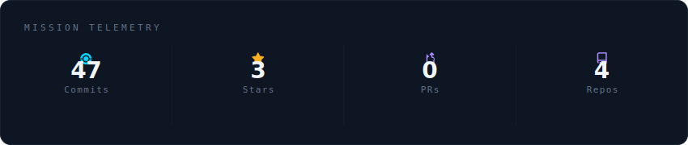

<!-- Cabeçalho da Galáxia -->

  

<!-- Tecnologias e Status -->

  

  

<!-- Constelação de Projetos -->
<h3 align="center">🌌 Projetos Destacados</h3>

  

---

### Bio
Sou Analista de Qualidade de Software (QA)/QA Engineer, bacharel em Sistemas de Informação e focado em garantir a entrega de produtos com alta confiabilidade e estabilidade. Tenho experiência em modelagem de cenários de teste, automação de testes (Web, Mobile e API) e integração de testes em pipelines de CI/CD. Também possuo experiência com automação utilizando Cypress, Selenium, Playwright e Robot Framework, além de testes de carga com JMeter e K6 + Grafana.

#### Especializações & Práticas:
* **QA Engineering & Práticas SDET** (Page Object Model, Custom Commands)
* **Automação de Testes** (Web, Mobile, APIs e Performance)
* **Gestão de Defeitos & Ciclo de Vida de Testes** (Jira, DevOps)
* **Metodologias Ágeis** (Scrum, Kanban)
* **Desenvolvimento assistido com IA** (Claude, GitHub Copilot)

#### Meus Contatos:
<!-- Minhas Redes e Contato -->

    
    
    

